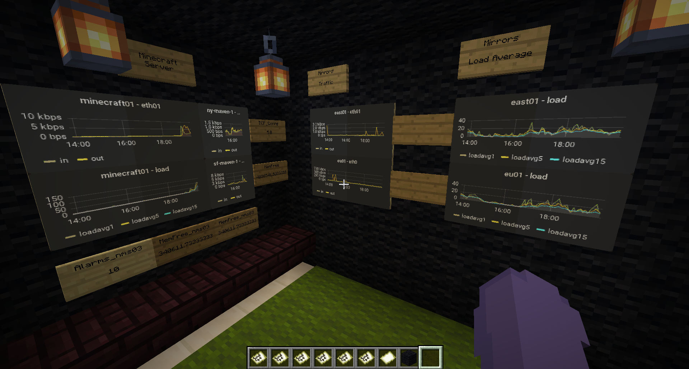

# MinecraftNOC
DevJam 2020 project: In-game NOC boards

## Overview
MinecraftNOC is a Spigot plugin that retrieves arbitrary values from the OpenNMS REST API and panel images from Grafana dashboards. Multiple dashboards are supported.
These are displayed in game on signs and framed maps respectively, allowing the player to build a fully immersive collaborative virtual environment that displays real-world data. Signs and maps can be placed in any valid game location to allow for free design of the display. Images can span multiple framed maps to allow for larger sizes and rectangluar shapes.

Metrics are added to the display by clicking a sign with the selection wand (a stick) then executing a command to pass in the partial REST URL. Images are added by placing framed maps in the desired shape, left-clicking the top left framed map and then right-clicking the bottom right framed map. All maps in the selected rectangle will be added to the tile set. Once selected, a command is executed to fetch and assign the image to the set of maps.

Left-clicking the air will clear the currently-selected object.

All configuration is saved in real time and loaded when the server starts. A worker thread updates the data at a user-defined interval.

## Requirements and Compatibility
 * Java 11
 * Spigot 1.15.2
 * OpenNMS Meridian 2019 or higher (Horizon 26+ also works)
 * Grafana with PhantomJS for panel rendering

## Commands
 * `/getpng panelID`  -- load the panel with the given `ID` from the current dashboard
 * `/getmetric Title partialURL JsonPointer` -- fetch a JSON result from the REST API defined by the base URL in `config.yml` plus `partialURL`, extracting the property defined by `JsonPointer`
   * `/getmetric nodesnmp Title nodeID property` -- helper for getting node SNMP properties such as `loadavg5`
   * `/getmetric ifsnmp Title nodeID interfaceID property` -- helper for getting interface statistic such as `ifHCInOctets`
 * `/dashboard Operation [Tag] [URL]` -- manage Grafana dashboards from which we pull images
   * `/dashboard list` -- show the configured dashboard tags and URL paths
   * `/dashboard select Tag` -- set Tag as the current dashboard for /getpng
   * `/dashboard remove Tag` -- remove the specified dashboard from config
   * `/dashboard add Tag URL` -- add the specified dashboard to config
 
 ## Known Issues
 So many! A few are:
 
  * Image rendering can lag the server even though it is in a thread
  * Very little error checking
  * Removing a sign can cause plugin exception (delete it from config.yml first)
 
 ## Future Work
  * Robustify and optimize
  * Multiple OpenNMS and Grafana instances
  * Span larger text results across multiple sign lines/multiple signs
  * Scrolling and colored sign text
  * Permissions
  * Custom selection wand item and command to get it
  * Additional image sources (e.g. Azure dashboards)
  * Remove maps/signs from config on block break event
  * Support REST requests with POST and JEXL expressions
  
  ## Special Thanks
  Chris Manigan for the original idea to do a virtual NOC in Minecraft, wrangling OpenNMS and Grafana, and building the NOC room.
  Alexis Knox for helping with the plugin code.
  
